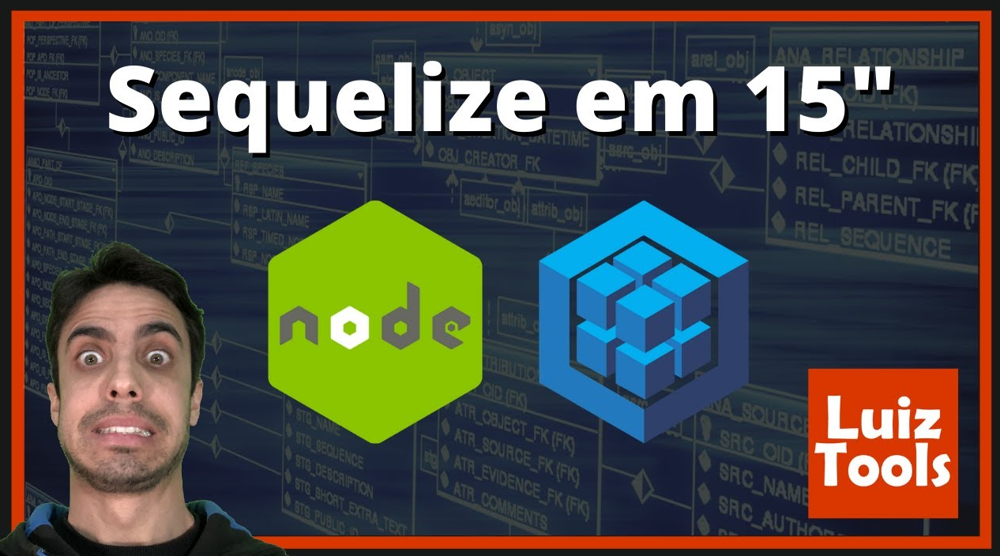

# Sequelize em 15 minutos, direto ao ponto!

https://www.youtube.com/watch?v=g5ij7NIPR2s&ab_channel=LuizTools

No vídeo de hoje eu vou lhe ensinar os fundamentos do Sequelize, na prática, em apenas 15 minutos.
Com isso, você vai aprender a como utilizar os principais bancos de dados SQL do mercado em conjunto do Node.js, de maneira muito fácil e simples.

**Project** --> BackEnd service for product register w/ sequelize 
**Channel** --> LuizTools 22,4 mil inscritos 
**Date Created** --> 5 de abr. de 2023

### Git Commands

mkdir sequelize-demo 
cd sequelize-demo 
npm init -y 
npm i sequelize mysql2

node db.js 
node index.js

### Observations

-  node created project
-  installed sequelize w/ mysql2
-  running project via node "fileToRun"

### Components

-  db
-  product
-  index
